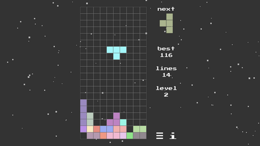

# TETRIS

Collect as many lines of tetramino shapes as possible until the playing field is full.  

Keyboard & Joystick:  
\<Left\>/\<Right\> - move  
\<Up\>/\<Joy0\> - rotate/select  
\<Down\> - down/select  
\<Space\>/\<Joy1\> - drop  
\<Esc\>/\<Joy2\> - menu  
\<i\>/\<Joy3\> - info  
\<r\> - resume  
\<n\> - new game  
\<m\> - music  
\<s\> - sound  
\<e\> - exit  

Touch:  
\<Swipe Left/Right\> - move  
\<Swipe Up\> - rotate  
\<Swipe Down\> - down  
\<Long Swipe Down\> - drop  

Powered by PyGame ;)  
(c) A.V.Bezdolny 2020  
\* ver. 1.0 \*
